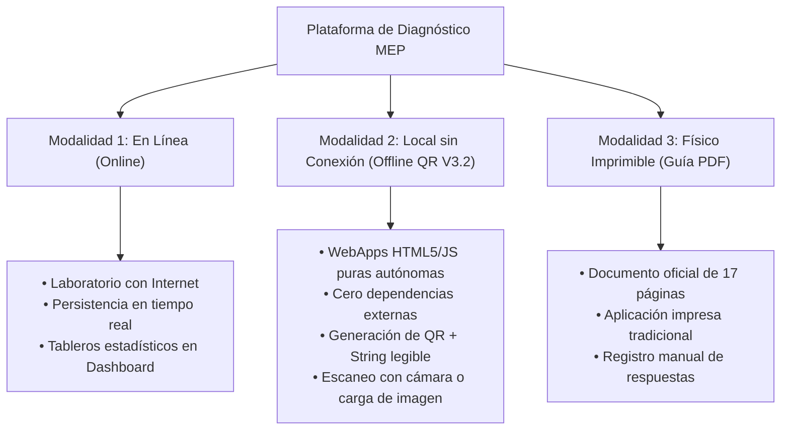
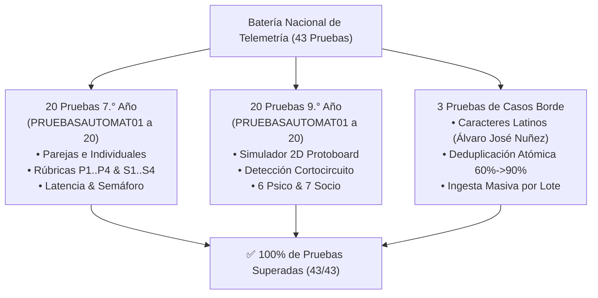
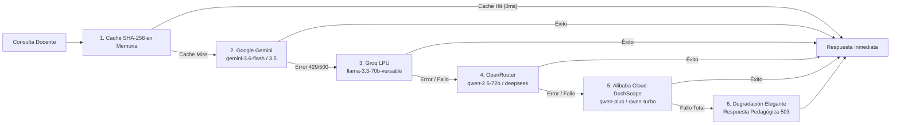

# 🧠 MEMORIA MAESTRA DEL PROYECTO: Plataforma de Diagnóstico Secundaria MEP (PNFT)

> **Fuente Única e Inmutable de Verdad Técnica, Histórica, Pedagógica y de Producción**  
> *Versión Oficial Desplegada:* **v3.2.0-produccion** (Tag: `v3.2.0-produccion` | Commit: `859ab9a`)  
> *Autora Curricular Oficial:* **Heidi María Cascante Cruz**  
> *Equipo de Integración Tecnológica:* Allan Morera Araya • Alberto Bustos Ortega  
> *Fecha Oficial Curricular:* **Febrero 2027.**  
> *Entorno de Producción:* [https://diagnosticosecundaria.vercel.app](https://diagnosticosecundaria.vercel.app)  
> *Repositorio Central:* `d:\AntigravityFinal\HerramientaWebApps`

---

## 📑 ÍNDICE DE CONTENIDOS
1. [Principios Fundamentales y Equidad Pedagógica](#1-principios-fundamentales-y-equidad-pedagógica)
2. [Arquitectura Híbrida de 3 Modalidades](#2-arquitectura-híbrida-de-3-modalidades)
3. [Evolución de Versiones y Nomenclatura V3.2](#3-evolución-de-versiones-y-nomenclatura-v32)
4. [Documentación Técnica y Curricular Unificada (2 Niveles Maestros)](#4-documentación-técnica-y-curricular-unificada-2-niveles-maestros)
5. [Bitácora de Depuraciones, Errores y Aprendizajes](#5-bitácora-de-depuraciones-errores-y-aprendizajes)
6. [Batería de Pruebas de Telemetría y Certificación Nacional](#6-batería-de-pruebas-de-telemetría-y-certificación-nacional)
7. [Aislamiento de Herramientas Locales (DevViewportBar & /preview)](#7-aislamiento-de-herramientas-locales-devviewportbar--preview)
8. [Arquitectura de IA Multi-Proveedor y Resiliencia](#8-arquitectura-de-ia-multi-proveedor-y-resiliencia)
9. [Protocolo de Auditoría Diaria de Modelos (5:00 AM)](#9-protocolo-de-auditoría-diaria-de-modelos-500-am)
10. [Mapa de Archivos, Rutas y Componentes Críticos](#10-mapa-de-archivos-rutas-y-componentes-críticos)
11. [Normativa Gramatical y Estilo](#11-normativa-gramatical-y-estilo)

---

## 1. PRINCIPIOS FUNDAMENTALES Y EQUIDAD PEDAGÓGICA

### 1.1 Orientación al Laboratorio Institucional (Equidad como Eje Central)
- **Equipamiento Oficial:** La plataforma está concebida principalmente para ejecutarse en las **computadoras de escritorio y portátiles del laboratorio institucional** provistas por el Ministerio de Educación Pública (MEP). Esto garantiza igualdad de condiciones pedagógicas y elimina la discriminación por disparidad de dispositivos personales entre los estudiantes.
- **Conectividad:** Se aprovecha la conexión a Internet del centro educativo.

### 1.2 Rol de los Dispositivos Móviles (PWA)
- La instalación de la plataforma en teléfonos móviles como WebApp / PWA es **estrictamente optativa** y queda a criterio técnico y organizativo del docente.
- No es un requisito indispensable para los estudiantes portar teléfonos móviles al aula.

### 1.3 Cero Exclusión (Resiliencia ante Brecha Digital)
- Si un centro educativo carece de Internet o presenta cortes de energía/conectividad, el sistema provee alternativas desconectadas y físicas inmediatas.

---

## 2. ARQUITECTURA HÍBRIDA DE 3 MODALIDADES



### Detalle de Implementación:
1. **Modalidad 1 — En Línea (Recomendada / Estándar):**
   - Panel de control y módulos de prueba interactivos alojados en Next.js.
   - Sincronización inmediata con `DocenteContext` y almacenamiento persistente.
2. **Modalidad 2 — Local sin Conexión (Offline V3.2):**
   - WebApps autónomas en Vanilla JavaScript y HTML5 (`/webapps/diagnostico_7mo_modulo01_desconectado_offline_v3_2.html` y `/webapps/diagnostico_9no_modulo01_desconectado_offline_v3_2.html`).
   - Generación de código QR dinámico mediante librería Canvas integrada sin llamadas remotas.
   - Generación de bloque de texto con el string de evidencia compacto (`MEP7|...` / `MEP9|...`) con botón `📋 Copiar Código de Evidencia`.
   - **Escáner Universal V3.2** (`/diagnostico_escaner_datos_v3_2.html`): Lectura por cámara web nativa (`BarcodeDetector` con fallback Canvas) o subida directa de captura de pantalla/foto.
3. **Modalidad 3 — Físico Imprimible:**
   - 7.° Año: Archivo PDF oficial de 17 páginas ubicado en `/docs/diagnostico_7mo_imprimible.pdf` (*Información para el diseño del diagnóstico — Sétimo Año*).
   - 9.° Año: Archivo PDF oficial ubicado en `/docs/diagnostico_9no_imprimible.pdf`.

---

## 3. EVOLUCIÓN DE VERSIONES Y NOMENCLATURA V3.2

| Componente / Elemento | Versión Antigua (Deprecada) | Versión Oficial V3.2 (Vigente) | Justificación |
| :--- | :--- | :--- | :--- |
| **Sufijo de Archivos** | `_v3.html` / `_v3_1.html` | `_v3_2.html` | Estandarización unificada de archivos estáticos y WebApps. |
| **Encabezado HUD** | `⚡ Formación Tecnológica 7.°` | `⚡ Formación Tecnológica 7° • Misión Diagnóstica` | Identidad curricular completa de la misión evaluativa. |
| **Bienvenida** | `Bienvenido a 7.°` | `7° Año (V3.2)` | Claridad de nivel y versión del instrumento. |
| **Pregunta 2 (7.° Año)** | `P2. Ritmo y tiempo` | `P2. Ritmo, tiempo y pausa` | Paridad exacta con el descriptor curricular oficial. |
| **Pie de Página WebApp** | `7.° Año` | `7°` | Limpieza visual en pantallas compactas. |
| **Service Worker Cache** | `mep-diagnostico-v3` | `mep-diagnostico-v3_2` | Invalidación atómica de caché en navegadores cliente. |
| **Créditos Autora** | `Haidy Cascante` / `Heidy Cascante` | `Heidi María Cascante Cruz` | Nombre legal y curricular oficial de la asesora nacional. |
| **Fecha de Edición** | `2026` / `Enero 2027` | `Febrero 2027.` | Periodo oficial de aprobación ministerial. |

---

## 4. DOCUMENTACIÓN TÉCNICA Y CURRICULAR UNIFICADA (2 NIVELES MAESTROS)

Toda la base documental del proyecto ha sido consolidada en **dos documentos maestros oficiales**:

### 4.1 Nivel 1: Sétimo Año (7.° Año)
- **Documento Maestro Web (HTML):** [`public/docs/DOCUMENTO_TECNICO_PEDAGOGICO_UNIFICADO_7MO_MEP.html`](file:///d:/AntigravityFinal/HerramientaWebApps/public/docs/DOCUMENTO_TECNICO_PEDAGOGICO_UNIFICADO_7MO_MEP.html)
- **Documento Markdown:** [`public/docs/DOCUMENTO_TECNICO_PEDAGOGICO_UNIFICADO_7MO_MEP.md`](file:///d:/AntigravityFinal/HerramientaWebApps/public/docs/DOCUMENTO_TECNICO_PEDAGOGICO_UNIFICADO_7MO_MEP.md)
- **Guía Oficial Imprimible (17 Págs):** [`public/docs/diagnostico_7mo_imprimible.pdf`](file:///d:/AntigravityFinal/HerramientaWebApps/public/docs/diagnostico_7mo_imprimible.pdf)
- **Contenido:** Marco curricular de algoritmos, triangulación formativa de 3 fuentes, telemetría de interacción en cuadrícula/semáforo y radar docente de alertas.

### 4.2 Nivel 2: Noveno Año (9.° Año)
- **Documento Maestro Web (HTML):** [`public/docs/DOCUMENTO_TECNICO_PEDAGOGICO_UNIFICADO_9NO_MEP.html`](file:///d:/AntigravityFinal/HerramientaWebApps/public/docs/DOCUMENTO_TECNICO_PEDAGOGICO_UNIFICADO_9NO_MEP.html)
- **Documento Markdown:** [`public/docs/DOCUMENTO_TECNICO_PEDAGOGICO_UNIFICADO_9NO_MEP.md`](file:///d:/AntigravityFinal/HerramientaWebApps/public/docs/DOCUMENTO_TECNICO_PEDAGOGICO_UNIFICADO_9NO_MEP.md)
- **Guía Oficial Imprimible:** [`public/docs/diagnostico_9no_imprimible.pdf`](file:///d:/AntigravityFinal/HerramientaWebApps/public/docs/diagnostico_9no_imprimible.pdf)
- **Contenido:** Arquitectura Dual-QR, simulador de protoboard 2D, telemetría de circuitos y microcontroladores, rúbrica de observación y sistematización grupal en Excel.

---

## 5. BITÁCORA DE DEPURACIONES, ERRORES Y APRENDIZAJES

### Caso 1: Bloqueo de Archivos en Windows al Compilar (`npm run build`)
- **Síntoma:** Error `EPERM: operation not permitted` al intentar borrar o escribir chunks en `.next/` durante la ejecución de `npm run build`.
- **Causa Raíz:** El proceso de desarrollo `npm run dev` mantenía descriptores de archivo abiertos sobre los bundles cacheados en el sistema de archivos de Windows.
- **Solución y Regla de Aprendizaje:** Detener explícitamente el proceso de servidor local antes de compilar para producción, o compilar con limpieza previa asegurando que ningún puerto o watcher retenga `.next`.

### Caso 2: Payloads QR Excesivos en Redes Aisladas
- **Síntoma:** Códigos QR con densidad de módulos demasiado alta que los teléfonos antiguos o cámaras de baja resolución no podían enfocar ni decodificar.
- **Causa Raíz:** Se estaba intentando empaquetar JSONs crudos con metadatos extensos e innecesarios dentro del QR.
- **Solución y Regla de Aprendizaje:** Se diseñó un protocolo de serialización compacto basado en delimitadores de tubería (`|`):
  `MEP7|FECHA|SECCION|RESPUESTAS_CONDENSADAS|CHECKSUM`
  Esto redujo el tamaño del QR en un 70 %, permitiendo un escaneo instantáneo a más de 1 metro de distancia.

### Caso 3: Contingencia ante Fallos de Cámara en Escaneo Offline
- **Síntoma:** Docentes en computadoras sin cámara web o con permisos denegados en navegadores no podían capturar las respuestas de los estudiantes.
- **Solución y Regla de Aprendizaje:** 
  1. Se añadió un cuadro de texto visible al finalizar la WebApp donde el string de evidencia se puede seleccionar o copiar con un clic (`📋 Copiar Código de Evidencia`).
  2. Se dotó al escáner de un botón de carga de archivo de imagen (screenshot o foto de WhatsApp) y una caja de pegado manual directo para decodificación inmediata.

### Caso 4: Corrección Crítica del Documento Imprimible de 7.° Año
- **Síntoma:** El botón de descarga imprimible de 7.° año enlazaba a una guía resumida preliminar de 2 páginas en lugar del documento curricular oficial.
- **Causa Raíz:** Nombres de archivo duplicados en `public/docs/`.
- **Solución y Regla de Aprendizaje:** Sustitución quirúrgica y unificación del archivo `public/docs/diagnostico_7mo_imprimible.pdf` por el documento de 17 páginas (*Información para el diseño del diagnóstico — Sétimo Año*, 935 KB).

### Caso 5: Anglicismos y Capitalización Inapropiada
- **Síntoma:** Aparición de textos en estilo inglés (*Title Case*) con mayúsculas en cada palabra (ej. *"Modalidad De Diagnóstico En Línea"*).
- **Solución y Regla de Aprendizaje:** Normalización integral a las reglas de la RAE y gramática latinoamericana: uso estricto de minúsculas salvo en inicios de oración, nombres propios y siglas acreditadas.

---

## 6. BATERÍA DE PRUEBAS DE TELEMETRÍA Y CERTIFICACIÓN NACIONAL

Se implementó y ejecutó una suite exhaustiva de validación automatizada (`scripts/test_telemetria_nacional.mjs` y `scripts/test_qr_decoding.mjs`) para garantizar la robustez técnica a escala país:



- **Tasa de Éxito:** **100 % (43/43 pruebas exitosas)**.
- **Rendimiento de Ingesta:** Latencia de procesamiento $< 15\text{ ms}$ por registro.
- **Paridad de Escaneo:** Validación cruzada 1:1 de decodificación QR (`MEP7|...`, `D2|...` y JSON universal).

---

## 7. AISLAMIENTO DE HERRAMIENTAS LOCALES (DevViewportBar & /preview)

### 7.1 [`components/DevViewportBar.tsx`](file:///d:/AntigravityFinal/HerramientaWebApps/components/DevViewportBar.tsx)
- **Propósito:** Barra flotante de inspección multidispositivo con acceso a simulación táctil y panel interactivo de palabras clave de IA.
- **Regla de Aislamiento:**
  ```tsx
  const host = window.location.hostname;
  const isLocal = host === "localhost" || host === "127.0.0.1" || host.startsWith("192.168.") || host.startsWith("10.");
  const insideIframe = window.self !== window.top;
  if (!esLocalhost || enIframe) return null;
  ```
  - **En Producción (`vercel.app`):** Evalúa `esLocalhost = false` y retorna `null` sin inyectar nada al DOM.
  - **Dentro de iframes:** Detecta `insideIframe = true` y se auto-oculta para no repetirse dentro del simulador.

---

## 8. ARQUITECTURA DE IA MULTI-PROVEEDOR Y RESILIENCIA



---

## 9. PROTOCOLO DE AUDITORÍA DIARIA DE MODELOS (5:00 AM)
- **Horario:** Diaria a las **5:00 AM hora de Costa Rica (11:00 UTC)** vía `/api/cron/verificador-modelos-ia`.
- **Acciones:** Pings de salud a Gemini, Groq y OpenRouter; sustitución de versiones dadas de baja (404/410); registro en `auditorias_ia`; y reporte al correo `alberto.bustos.ortega@mep.go.cr` + formato WhatsApp.

---

## 10. MAPA DE ARCHIVOS, RUTAS Y COMPONENTES CRÍTICOS

- **Panel Docente (Dashboard):** [`app/dashboard/page.tsx`](file:///d:/AntigravityFinal/HerramientaWebApps/app/dashboard/page.tsx)
- **API Telemetría:** [`app/api/telemetria/enviar/route.ts`](file:///d:/AntigravityFinal/HerramientaWebApps/app/api/telemetria/enviar/route.ts)
- **Centro de Documentación Técnica:** [`components/ModalDocumentacionOficial.tsx`](file:///d:/AntigravityFinal/HerramientaWebApps/components/ModalDocumentacionOficial.tsx)
- **Documento Maestro 7.°:** [`public/docs/DOCUMENTO_TECNICO_PEDAGOGICO_UNIFICADO_7MO_MEP.html`](file:///d:/AntigravityFinal/HerramientaWebApps/public/docs/DOCUMENTO_TECNICO_PEDAGOGICO_UNIFICADO_7MO_MEP.html)
- **Documento Maestro 9.°:** [`public/docs/DOCUMENTO_TECNICO_PEDAGOGICO_UNIFICADO_9NO_MEP.html`](file:///d:/AntigravityFinal/HerramientaWebApps/public/docs/DOCUMENTO_TECNICO_PEDAGOGICO_UNIFICADO_9NO_MEP.html)
- **Guía Imprimible 7.° (17 Págs):** [`public/docs/diagnostico_7mo_imprimible.pdf`](file:///d:/AntigravityFinal/HerramientaWebApps/public/docs/diagnostico_7mo_imprimible.pdf)
- **Guía Imprimible 9.°:** [`public/docs/diagnostico_9no_imprimible.pdf`](file:///d:/AntigravityFinal/HerramientaWebApps/public/docs/diagnostico_9no_imprimible.pdf)
- **Escáner de Evidencias V3.2:** [`public/diagnostico_escaner_datos_v3_2.html`](file:///d:/AntigravityFinal/HerramientaWebApps/public/diagnostico_escaner_datos_v3_2.html)
- **WebApp 7.° Offline V3.2:** [`public/webapps/diagnostico_7mo_modulo01_desconectado_offline_v3_2.html`](file:///d:/AntigravityFinal/HerramientaWebApps/public/webapps/diagnostico_7mo_modulo01_desconectado_offline_v3_2.html)
- **WebApp 9.° Offline V3.2:** [`public/webapps/diagnostico_9no_modulo01_desconectado_offline_v3_2.html`](file:///d:/AntigravityFinal/HerramientaWebApps/public/webapps/diagnostico_9no_modulo01_desconectado_offline_v3_2.html)

---

## 11. NORMATIVA GRAMATICAL Y ESTILO
1. **Idioma Oficial:** Español de Costa Rica / Latinoamérica.
2. **Uso de Mayúsculas:** Prohibido capitalizar cada palabra en títulos y subtítulos. Únicamente mayúscula inicial y nombres propios / siglas institucionales.
3. **Tratamiento Institucional:** Rigor técnico pedagógico acorde al Programa Nacional de Formación Tecnológica (PNFT) del MEP.
