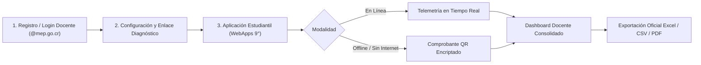
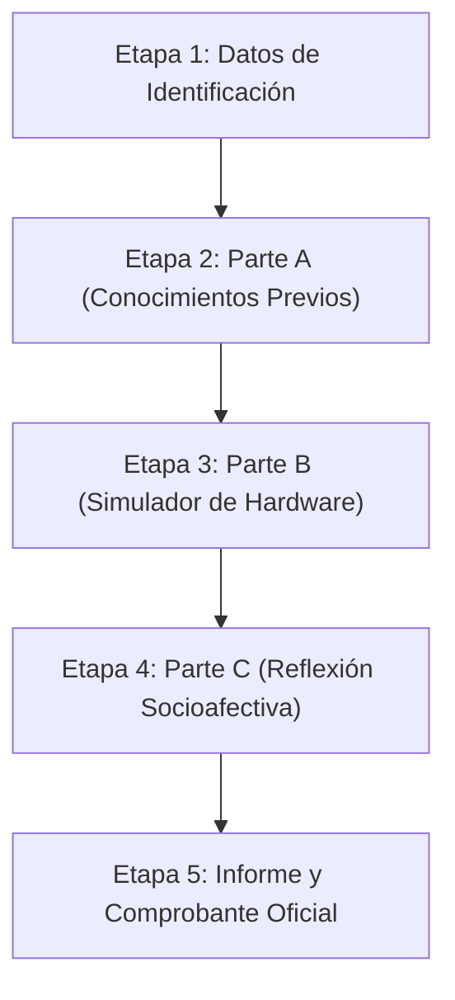

# 📘 Manual de Usuario y Guía Metodológica Oficial
## Plataforma de Evaluación Diagnóstica y Telemetría en Formación Tecnológica (MEP 2026)

---

> [!NOTE]
> **Enfoque Pedagógico Institucional**: La plataforma implementa el paradigma de **evaluación formativa por criterios de logro y saberes demostrados** (*Consolidado, En Desarrollo, Requiere Acompañamiento*), erradicando las calificaciones punitivas de 0 a 100 para centrarse en el acompañamiento pedagógico oportuno.

---

---

## 🧑‍🏫 SECCIÓN I: GUÍA PARA LA PERSONA DOCENTE Y ASESORÍA

> [!IMPORTANT]
> **Paso Esencial y Requisito Previo Obligatorio: Registro y Autenticación de la Persona Docente**
> Antes de distribuir cualquier enlace o archivo de diagnóstico a los estudiantes, **la persona docente debe iniciar sesión o registrarse previamente en la plataforma web**. 
> 
> **¿Por qué es indispensable este paso?**
> 1. **Vinculación Telemétrica Automática**: Al iniciar sesión, la plataforma genera y asigna su identificador único institucional (`docenteId`), el cual se incrusta automáticamente en los enlaces web, códigos QR y archivos `.html` descargables.
> 2. **Trazabilidad y Seguridad de los Datos**: Garantiza que las respuestas emitidas por los estudiantes en cualquier computadora o celular viajen de forma directa y exclusiva al **Dashboard personal del docente**, evitando que los datos se dispersen o mezclen con los de otros grupos o instituciones.
> 3. **Bloqueo de Seguridad en la WebApp del Estudiante**: La aplicación precarga el nombre del docente y del centro educativo en modo de solo lectura, impidiendo que el estudiante los altere accidentalmente.

### 1. Registro e inicio de sesión
1. **Dominio oficial obligatorio**: Ingrese siempre con su correo institucional `@mep.go.cr`.
2. **Formato de cédula**: Digite su número de identificación costarricense con 9 dígitos (incluyendo los ceros correspondientes, ej: `5-0305-0179`).
3. **Roles y privilegios**:
   - **Persona docente**: Acceso total al catálogo de WebApps interactivas, proyección en aula, dashboard de su grupo y reportes de telemetría.
   - **Asesoría regional / Asesoría nacional**: Acceso analítico macro-regional, comparativas por circuito y acompañamiento docente.
   - **Superadministrador de gobernanza** (*Alberto Bustos Ortega*): Panel exclusivo de validación de credenciales, auditoría diaria de modelos IA y habilitación nacional.

---

### 2. Preparación y gestión en el laboratorio de cómputo
Cuando aplique la prueba diagnóstica en el laboratorio escolar con equipos compartidos (turnos de estudiantes en la misma máquina):

* **Enlace único personalizado**: Comparta el enlace generado en su panel o abra el archivo `.html` en los navegadores de los equipos del laboratorio.
* **Flujo automatizado para el siguiente estudiante**:
  1. Cuando un estudiante entrega su prueba, el sistema transmite las respuestas al Dashboard Docente.
  2. En la pantalla de entrega o comprobante aparece el botón verde:
     > **`✨ Iniciar siguiente estudiante`**
  3. Al pulsar este botón, la WebApp **limpia de forma automática** el nombre, cédula y respuestas del estudiante anterior, pero **mantiene precargados y protegidos** el nombre del docente, la institución y la sección.
  4. El equipo queda desbloqueado en la Etapa 1 para el próximo alumno de forma instantánea.

---

### 3. Monitoreo en Tiempo Real y Cierre Pedagógico (Dashboard)
* **Semáforo Formativo de Saberes**: Podrá visualizar en vivo cuántos estudiantes han consolidado cada saber específico (microcontroladores, entradas/salidas, depuración física).
* **Atención a la Diversidad**: El sistema resalta a los estudiantes que se encuentran *En Desarrollo* o que *Requieren Acompañamiento* para planificar los apoyos educativos del curso lectivo.
* **Exportación y Respaldo**: Descargue las planillas oficiales en formatos Excel/CSV con el padrón del grupo y las firmas de verificación digital Hash.

---

## 🎒 SECCIÓN II: GUÍA PASO A PASO PARA LA PERSONA ESTUDIANTE

### 1. Etapa 1: Identificación y Registro
* **Campos 100% en Blanco**: Al abrir la WebApp, todos los campos del estudiante (Nombre y Apellidos, Cédula, Correo) se presentan totalmente vacíos y listos para su ingreso, sin nombres de prueba ni datos residuales.
* **Sincronización Interna Protegida**: Los datos de la persona docente y del centro educativo se precargan automáticamente en modo protegido (solo lectura) para garantizar la sincronización telemétrica exacta con el Dashboard del docente.
* Escribe tu nombre y dos apellidos completos.
* Selecciona tu sección asignada (ej: `Sección 9-1`).
* Escribe tu número de cédula y correo institucional `@est.mep.go.cr` (si cuentas con él).
* Presiona **`Comenzar Parte A`**. Tus datos quedarán asegurados para evitar cambios accidentales.

---

### 2. Etapa 2: Parte A — Área Cognoscitiva (Conocimientos Previos)
* Responderás **10 reactivos interactivos** sobre microcontroladores, sensores, lógica algorítmica y depuración.
* Al seleccionar una opción, el sistema te brindará **retroalimentación pedagógica instantánea** para reforzar tu comprensión.

---

### 3. Etapa 3: Parte B — Simulación Práctica y Depuración de Hardware
* **Reto 1 (Conexión Física)**: Conecta los terminales del Sensor LDR (`VCC`, `GND`, `A0`) y del Actuador LED (`D9`, `GND`) al microcontrolador.
* **Reto 2 (Adaptación)**: Explora el funcionamiento del circuito cambiando entre diferentes actuadores (LED, Ventilador, Alarma Sonora).
* **Reto 3 (Depuración Técnica)**: Identifica por qué una propuesta con falla no lee la luz ambiental y realiza la reconexión al pin analógico correcto.

---

### 4. Etapa 4: Parte C — Reflexión Socioafectiva y Metacognición
* Responde con sinceridad cómo te sentiste durante la actividad y qué áreas te resultaron más sencillas o desafiantes.
* Selecciona tu estado de ánimo general ante los retos tecnológicos.

---

### 5. Etapa 5: Entrega y Comprobante Oficial
* El sistema genera tu **Informe de Saberes Demostrados** y un **Comprobante Digital Hash**.
* **Si tienes internet**: Tu diagnóstico se transmite automáticamente al docente.
* **Si estás sin conexión**: Muestra el **Código QR** en pantalla a tu profesor para que lo escanee con su dispositivo.
* Al terminar, presiona **`✨ Iniciar Siguiente Estudiante`** para dejar el equipo listo a tu compañero.

---

## 📌 Bitácora de Versiones y Mantenimiento

| Versión | Componente | Mejora Implementada |
| :--- | :--- | :--- |
| **v2.4** | `WebApps 9°` | Automatización de reseteo para laboratorios compartidos (`prepararSiguienteEstudiante`). |
| **v2.3** | `Dashboard / Navbar` | Restricción estricta de gobernanza exclusiva para Super Admin (`alberto.bustos.ortega@mep.go.cr`). |
| **v2.2** | `Evaluación` | Migración de métricas cuantitativas (%) a saberes formativos (`X/10 Saberes Demostrados`). |
| **v2.1** | `UI / UX` | Estandarización de paleta calma pastel (`#FAF8F5`, salvia, cielo y lavanda) y cédula de 9 dígitos. |
