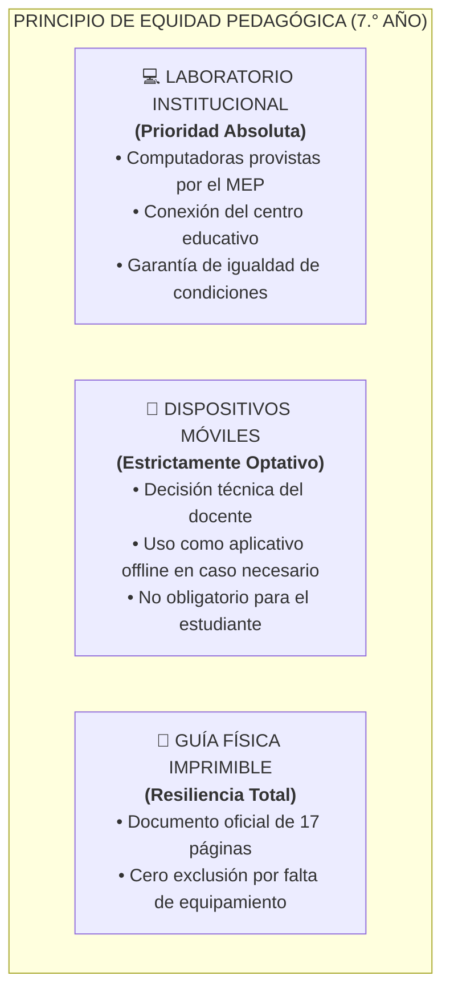
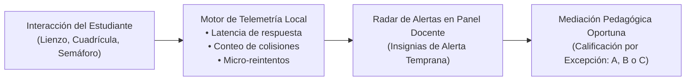

# MINISTERIO DE EDUCACIÓN PÚBLICA (MEP)
## Dirección de Recursos Tecnológicos en Educación (DRTE) • Departamento de IDI
### Programa Nacional de Formación Tecnológica (PNFT) — III Ciclo de la Educación Secundaria

---

# DOCUMENTO TÉCNICO-PEDAGÓGICO UNIFICADO: ARQUITECTURA DE EVALUACIÓN DIAGNÓSTICA TRI-MODAL, TELEMETRÍA Y SISTEMATIZACIÓN — 7.° AÑO

> **Versión Oficial:** V3.2  
> **Fecha Oficial:** Febrero 2027.  
> **Módulo Curricular:** Módulo 1 — Fundamentos de algoritmos, pensamiento computacional y trabajo colaborativo (7.° Año)  
> **Autora Curricular Oficial:** Heidi María Cascante Cruz  
> **Equipo de Integración Tecnológica:** Allan Morera Araya • Alberto Bustos Ortega  

---

## 1. RESUMEN EJECUTIVO Y JUSTIFICACIÓN PEDAGÓGICA

El presente documento constituye la **guía técnica, curricular y metodológica maestra para la aplicación de la Evaluación Diagnóstica Formativa en 7.° Año** dentro del Programa Nacional de Formación Tecnológica (PNFT).

### 1.1 El Desafío de la Transición de Primaria a Secundaria
El ingreso a 7.° año representa un momento crítico en la trayectoria educativa. Los estudiantes provienen de diversos entornos con marcadas diferencias en su alfabetización digital previa. Un instrumento puramente cuantitativo o una evaluación memorística tradicional genera:
1. **Falsos Negativos por Barrera de Interfaz:** Calificar como «falta de pensamiento lógico» a un estudiante que simplemente presenta dificultades temporales de motricidad fina con el ratón o el panel táctil.
2. **Ansiedad Evaluativa:** La percepción punitiva de la evaluación bloquea el rendimiento socioafectivo del alumno recién llegado a secundaria.
3. **Invisibilidad del Trabajo Colaborativo:** Las evaluaciones individuales no permiten apreciar la capacidad de escucha, diálogo y resolución conjunta de problemas.

### 1.2 La Solución: Modelo Híbrido Triangulado (3 Fuentes de Evidencia)
Para erradicar estos sesgos, la herramienta integra un modelo de **Triangulación Formativa**:
- **Fuente 1 — Telemetría Algorítmica (Digital):** Métricas objetivas de interacción en tiempo real (tiempos de reacción, trayectorias en cuadrícula, resolución de retos).
- **Fuente 2 — Autopercepción Metacognitiva (Estudiante):** Reflexión en parejas sobre roles de Líder y Copiloto, tolerancia a la frustración y gestión del error.
- **Fuente 3 — Observación Docente Cualitativa (Aula):** Criterio pedagógico presencial mediante radar de alertas y calificación por excepción (Niveles A, B y C).

---

## 2. PRINCIPIO RECTOR DE EQUIDAD Y ROLES DE LOS DISPOSITIVOS

1. **Prioridad al Equipamiento del Centro:** La experiencia diagnóstica está diseñada para aprovechar las computadoras de escritorio y portátiles del laboratorio institucional.
2. **Uso Móvil a Criterio Docente:** La instalación de la aplicación en teléfonos móviles es opcional y no constituye un requisito excluyente.
3. **Cero Exclusión ante Brecha Digital:** La institución que carezca de conectividad o computadoras dispone del aplicativo local desconectado y la guía física impresa de 17 páginas.

---

## 3. ARQUITECTURA TRI-MODAL DE APLICACIÓN

La plataforma ofrece 3 modalidades operativas con paridad curricular 1:1:

| Modalidad | Entorno / Recurso | Flujo de Datos y Captura | Caso de Uso |
| :--- | :--- | :--- | :--- |
| **1. En Línea** | Plataforma Digital en Línea | Persistencia centralizada y tabulación estadística en tiempo real para el docente. | Laboratorios con conexión estable a Internet. |
| **2. Local sin Conexión** | Aplicativo Interactivo Autónomo | Generación de Código QR dinámico y código de evidencia legible con botón de copiado rápido. Captura docente mediante Escáner Digital por cámara o carga de imagen. | Laboratorios sin Internet o con cortes de conectividad. |
| **3. Físico Imprimible** | Documento Oficial de 17 Páginas | Resolución manuscrita en papel y registro docente directo. | Centros sin infraestructura digital inmediata. |

---

## 4. DESGLOSE DE ÁREAS EVALUADAS Y CRITERIOS CURRICULARES

### 4.1 Dimensión Cognoscitiva (10 Criterios Digitales)
Evaluación de conceptos fundamentales con cálculo instantáneo (0% a 100%):
1. **Concepto de Algoritmo:** Secuencias ordenadas y finitas de pasos.
2. **Entrada-Proceso-Salida (E-P-S):** Identificación del flujo de datos.
3. **Reconocimiento de Patrones:** Detección de repeticiones y regularidades.
4. **Noción de Variable:** Almacenamiento y modificación de valores.
5. **Estructuras Condicionales:** Toma de decisiones lógicas (`si... entonces`).
6. **Descomposición de Problemas:** División en subproblemas manejables.
7. **Abstracción:** Filtrado de detalles irrelevantes.
8. **Depuración (Debugging):** Detección y corrección de errores algorítmicos.
9. **Pensamiento Lógico-Secuencial:** Ordenamiento temporal de instrucciones.
10. **Seguridad y Ética Digital:** Uso responsable de la tecnología.

*Escala de Logro:* Avanzado ($\ge 80\%$), Intermedio ($60\% - 79\%$), Inicial ($\le 59\%$).

---

### 4.2 Dimensión Psicomotora y Procedimental (Modelo Híbrido)

| Indicador Oficial | Tipo de Evaluación | Descripción Pedagógica y Telemetría |
| :--- | :---: | :--- |
| **P1. Orientación espacial y cuadrícula** | 🤖 Telemetría Digital | Navegación espacial, lateralidad y giros en cuadrícula 4x4 evitando obstáculos. |
| **P2. Ritmo, tiempo y pausa** | 🤖 Telemetría Digital | Control inhibitorio y tiempo de reacción ante estímulos visuales y cambios de ritmo. |
| **P3. Pulso y precisión en canal estrecho** | 🤖 Telemetría Digital | Estabilidad motriz y precisión de puntero en trayectorias continuas. |
| **P4. Motricidad fina y periféricos** | ⚡ Telemetría + 👨‍🏫 Docente | Trazo en lienzo interactivo y verificación docente de soltura con periféricos. |

---

### 4.3 Dimensión Socioafectiva (Híbrida Triangulada)

| Indicador Oficial | Tipo de Evaluación | Descripción Pedagógica |
| :--- | :---: | :--- |
| **S1. Gusto por la precisión y calidad** | 🤖 Telemetría + Autorreflexión | Minuciosidad y verificación de respuestas antes del envío definitivo. |
| **S2. Aprender del error (Metacognición)** | 🤖 Telemetría + Depuración | Resiliencia ante fallos en la cuadrícula e intentos autónomos de corrección. |
| **S3. Flexibilidad y trabajo colaborativo** | 👨‍🏫 Observación Docente | Diálogo en parejas, escucha activa y alternancia equitativa de roles Líder/Copiloto. |
| **S4. Tolerancia a la frustración y perseverancia** | 👨‍🏫 Observación Docente | Manejo de la calma ante retos complejos y culminación sistemática del diagnóstico. |

---

## 5. APROVECHAMIENTO TECNOLÓGICO Y SISTEMA DE TELEMETRÍA

La herramienta implementa un **motor de telemetría formativa en tiempo real**:

### Indicadores de Telemetría Monitoreados:
1. **Detección de Bloqueo o Bucle Espacial:** Registro cuando una pareja gira sobre sí misma reiteradamente sin avanzar hacia el objetivo.
2. **Latencia y Control Inhibitorio en Semáforo:** Medición precisa del tiempo de reacción y clics anticipados erráticos.
3. **Precisión de Trayectoria:** Desviación y estabilidad en el reto de pulso.
4. **Alerta de Monopolio de Rol:** Detección de patrones de interacción unilateral donde uno de los integrantes anula la participación del compañero.

---

## 6. PROTOCOLO DEL ESCÁNER Y CONTINGENCIA SIN CONEXIÓN

1. **Protocolo Compacto de Evidencias:** Los datos del estudiante se condensan en un formato de texto optimizado para lectura instantánea sin consumo de ancho de banda.
2. **Doble Mecanismo de Captura:**
   - **Vía Cámara:** Lectura instantánea del código QR individual generado por el estudiante.
   - **Vía Carga de Captura / Pegado Directo:** El estudiante puede copiar su código de evidencia con el botón de copiado o guardar una captura de pantalla para que el docente la procese en el escáner sin requerir cámara activa.

---

## 7. CRÉDITOS OFICIALES Y GOBERNANZA

- **Entidad Emisora:** Ministerio de Educación Pública de Costa Rica (MEP)
- **Dirección Responsable:** Dirección de Recursos Tecnológicos en Educación (DRTE)
- **Autora Curricular Oficial:** **Heidi María Cascante Cruz** (Asesoría Nacional de Formación Tecnológica)
- **Integración Tecnológica y Telemetría:** Allan Morera Araya • Alberto Bustos Ortega
- **Periodo Oficial:** Febrero 2027.
