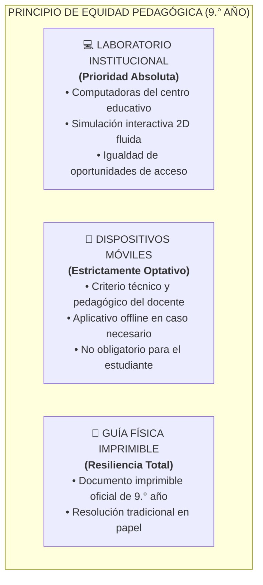
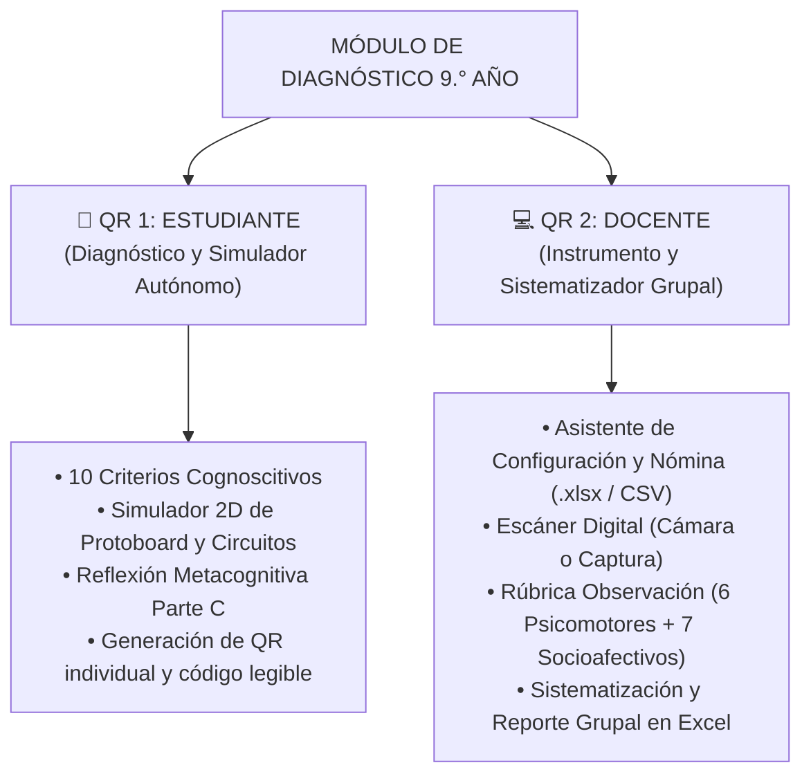

# MINISTERIO DE EDUCACIÓN PÚBLICA (MEP)
## Dirección de Recursos Tecnológicos en Educación (DRTE) • Departamento de IDI
### Programa Nacional de Formación Tecnológica (PNFT) — III Ciclo de la Educación Secundaria

---

# DOCUMENTO TÉCNICO-PEDAGÓGICO UNIFICADO: ARQUITECTURA DE EVALUACIÓN DIAGNÓSTICA DUAL-QR, SIMULADOR 2D, TELEMETRÍA Y SISTEMATIZACIÓN — 9.° AÑO

> **Versión Oficial:** V3.2  
> **Fecha Oficial:** Febrero 2027.  
> **Módulo Curricular:** Módulo 1 — Diagnóstico 9° y Sistemas Embebidos (Electrónica, sensores, actuadores y microcontroladores)  
> **Autora Curricular Oficial:** Heidi María Cascante Cruz  
> **Equipo de Integración Tecnológica:** Allan Morera Araya • Alberto Bustos Ortega  

---

## 1. RESUMEN EJECUTIVO Y JUSTIFICACIÓN PEDAGÓGICA

El presente documento establece la **arquitectura técnica, curricular y evaluativa unificada para la aplicación del Diagnóstico de 9.° Año** en el marco del Programa Nacional de Formación Tecnológica (PNFT).

### 1.1 Naturaleza del Nivel y Retos de Sistemas Embebidos
En 9.° año, los estudiantes consolidan el ciclo formativo de secundaria mediante el estudio de sistemas embebidos, prototipado electrónico y control algorítmico. Una evaluación diagnóstica en este nivel requiere:
1. **Validación Práctica de Circuitos:** La teoría por sí sola no demuestra si el estudiante comprende la polaridad de los componentes, la prevención de cortocircuitos o el conexionado en protoboard.
2. **Triangulación Formativa de Habilidades Técnicas y Socioafectivas:** Combinar la telemetría del simulador interactivo con la observación presencial del manejo seguro de periféricos y la ética colaborativa.
3. **Sistematización Inmediata por Sección:** Brindar al docente la consolidación instantánea de su nómina estudiantil para la toma de decisiones curriculares y planes de nivelación DUA.

---

## 2. PRINCIPIO RECTOR DE EQUIDAD Y ROLES DE LOS DISPOSITIVOS

1. **Prioridad al Laboratorio Institucional:** La experiencia está orientada prioritariamente a las computadoras del colegio, garantizando una visualización adecuada del simulador de protoboard 2D y el cableado virtual.
2. **Uso Móvil a Criterio Docente:** La instalación de la aplicación en celulares es optativa y no condiciona la participación del estudiante.
3. **Resiliencia Operativa:** Funcionamiento pleno en red local desconectada y mediante material impreso alternativo.

---

## 3. ARQUITECTURA DE DOS CÓDIGOS QR Y MODALIDADES

### Detalle de Modalidades:
1. **Modalidad En Línea:** Acceso directo desde el navegador en el laboratorio con persistencia centralizada.
2. **Modalidad Local sin Conexión:** Aplicativo autónomo con generación de código QR y código de evidencia con botón de copiado rápido, capturado por el Escáner Digital docente mediante cámara o carga de imagen.
3. **Modalidad Físico Imprimible:** Guía oficial en formato papel.

---

## 4. DESGLOSE DE ÁREAS EVALUADAS EN 9.° AÑO

### 4.1 Dimensión Cognoscitiva (10 Criterios Digitales)
1. **Fuentes y Conversión de Energía:** Identificación de tipos de alimentación y transformación.
2. **Circuito Simple:** Componentes básicos (fuente, interruptor, actuador, carga).
3. **Conductores vs. Aislantes:** Propiedades físicas de los materiales.
4. **Ley de Ohm Cualitativa:** Relación entre voltaje, corriente y resistencia ($V = I \cdot R$).
5. **Polaridad y Actuadores:** Reconocimiento de ánodo/cátodo en LEDs, servomotores y zumbadores.
6. **Sensores:** Principio de funcionamiento de fotoresistencias (LDR) y sensores analógicos.
7. **Sistemas Embebidos y Microcontroladores:** Función de la tarjeta de desarrollo como procesador central.
8. **Estructuras de Control Algorítmico:** Lógica condicional aplicada a hardware (`si sensor > umbral entonces encender actuador`).
9. **Seguridad y Prevención de Cortocircuitos:** Reglas críticas de protección del circuito.
10. **Protocolo de Trabajo y Desconexión:** Orden y apagado seguro en el laboratorio.

---

### 4.2 Dimensión Psicomotora y Procedimental (Simulador 2D + Observación)
* **Simulador Interactivo (Telemetría):** Ensamble en protoboard virtual de circuito con verificación instantánea de polaridad y continuidad.
* **Observación Docente en Aula (6 Indicadores):**
  1. Manipulación correcta y segura de herramientas e instrumentos de medición.
  2. Conexionado seguro de componentes sin riesgo de cortocircuito físico.
  3. Destreza en el ensamble en protoboard real.
  4. Seguimiento preciso de diagramas pictóricos y esquemáticos.
  5. Hábitos rigurosos de orden y limpieza en la mesa de trabajo.
  6. Autonomía procedimental en la ejecución de prácticas.

---

### 4.3 Dimensión Socioafectiva (7 Indicadores Triangulados)
1. Disposición para el trabajo colaborativo y escucha activa.
2. Respeto estricto a las normas de seguridad del laboratorio.
3. Cuidado y uso responsable de los componentes y materiales asignados.
4. Perseverancia ante fallos técnicos y actitud constructiva de depuración.
5. Ética y uso responsable de la tecnología.
6. Comunicación asertiva y fundamentada con compañeros y docentes.
7. Puntualidad y compromiso con las metas de la sesión.

---

## 5. APROVECHAMIENTO TECNOLÓGICO Y TELEMETRÍA EN 9.° AÑO

1. **Detección Telemétrica en Simulador 2D:**
   - Registro de intentos de cableado erróneo o conexiones invertidas en el protoboard virtual.
   - Tiempo de resolución y depuración del circuito.
2. **Sistematización Grupal Inmediata:**
   - Consolidado automático por reactivo y sección.
   - Semáforo de logro grupal con exportación directa a hoja de cálculo para la nivelación docente.

---

## 6. CRÉDITOS OFICIALES Y GOBERNANZA

- **Entidad Emisora:** Ministerio de Educación Pública de Costa Rica (MEP)
- **Dirección Responsable:** Dirección de Recursos Tecnológicos en Educación (DRTE)
- **Autora Curricular Oficial:** **Heidi María Cascante Cruz** (Asesoría Nacional de Formación Tecnológica)
- **Integración Tecnológica y Telemetría:** Allan Morera Araya • Alberto Bustos Ortega
- **Fecha Oficial:** Febrero 2027.
