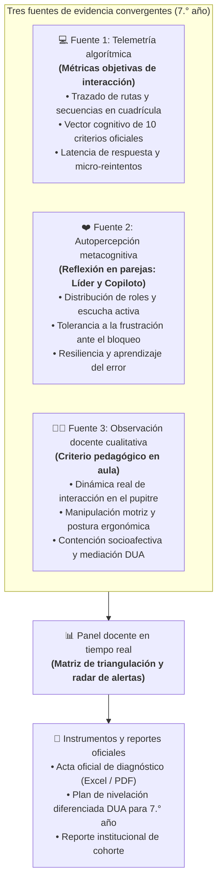
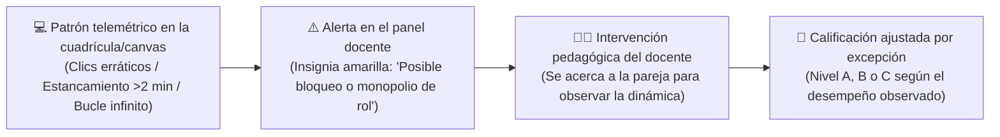
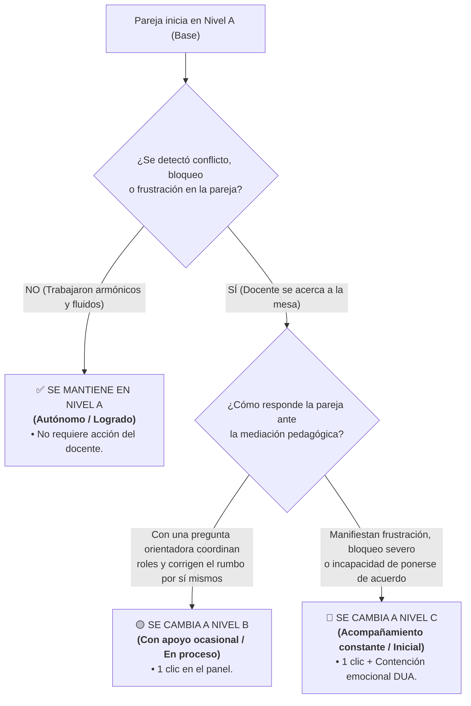

# Arquitectura de evaluación diagnóstica híbrida para 7.° año (triangulación formativa MEP 2027)
**Programa Nacional de Formación Tecnológica (PNFT) • Módulo 1: Diagnóstico Sétimo (Misión en parejas)**  
*Ministerio de Educación Pública de Costa Rica • Dirección de Recursos Tecnológicos en Educación (DRTE)*  
*Departamento de Investigación, Desarrollo e Implementación (IDI)*

**Elaborado por:**  
- Heidy María Cascante Cruz  
- Rodolfo Juárez Pérez  
*Asesoría Nacional de Formación Tecnológica • Dirección de Recursos Tecnológicos en Educación*  
**Fecha de emisión:** Febrero 2027  
**Versión del documento:** Versión oficial consolidada 1.0 — Enfoque híbrido triangulado para 7.° año

---

## 1. Resumen ejecutivo y diagnóstico del estado actual en 7.° año

En el nivel de Sétimo año de secundaria (III Ciclo), la evaluación diagnóstica del **Módulo 1: Fundamentos de algoritmos, pensamiento computacional y trabajo colaborativo** se implementó inicialmente bajo una modalidad en parejas (*Líder y copiloto*) con alta gamificación (*Diagnóstico Sétimo*).

### Situación actual y oportunidades de mejora identificadas
1. **Sobredependencia de la automatización algorítmica:** La versión preliminar pretende calificar de forma $100\%$ automatizada no solo el área cognoscitiva, sino también el área psicomotora (movimientos en cuadrícula, tiempos de reacción de semáforo) y el área socioafectiva (escalas Likert rígidas).
2. **Riesgo de falsos negativos por barreras de interfaz:** Un estudiante de 7.° año que ingresa por primera vez a la secundaria puede experimentar dificultades con el uso del panel táctil o el ratón en la cuadrícula de navegación, lo cual un algoritmo califica erróneamente como *«falta de razonamiento algorítmico»*, cuando en realidad es una limitación de motricidad fina o adaptación tecnológica.
3. **Ausencia de mediación formativa en el trabajo por parejas:** Al evaluar la colaboración únicamente mediante clics, el sistema no detecta si un estudiante acapara el dispositivo y anula la participación del copiloto, o si existe una dinámica de apoyo mutuo genuina.

### La solución: Implementación del modelo híbrido triangulado
Al igual que en noveno año, se propone estructurar la **Herramienta de Diagnóstico Estudiantes para 7.° año** bajo el principio de **Triangulación Formativa de tres fuentes convergentes**:

---

## 2. El radar pedagógico en tiempo real para 7.° año

En el laboratorio de informática, el docente visualiza en su panel las alertas generadas por la interacción de las parejas de 7.° año:

### Indicadores telemétricos específicos para 7.° año:
1. **Alerta de bucle o desorientación espacial:** El robot en la cuadrícula gira sobre sí mismo más de 6 veces sin avanzar hacia el objetivo.
2. **Alerta de estancamiento en el reto procedimental:** La pareja permanece inactiva por más de 2.5 minutos en la fase de trazado o selección de bloques.
3. **Alerta de discrepancia de roles:** Tasa de interacción desbalanceada donde solo uno de los dos integrantes interactúa con la pantalla mientras el otro permanece pasivo.

---

## 3. Desglose de áreas evaluadas: Máquina y docente en 7.° año

### 🧠 Dimensión 1: Área cognoscitiva (100% tecnológico)
* **Contenidos evaluados:** Concepto de algoritmo, secuencias ordenadas, reconocimiento de patrones, noción de variable y modelo entrada-proceso-salida (E-P-S).
* **Mecanismo:** 10 criterios oficiales de opción múltiple calificados de forma instantánea ($0\%$ a $100\%$) con vector de aciertos.
* **Escala oficial:**
  * **Avanzado:** $\ge 80\%$
  * **Intermedio:** $60\% - 79\%$
  * **Inicial:** $\le 59\%$

---

### 🖐️ Dimensión 2: Área psicomotora y procedimental (Modelo híbrido)

| Criterio | ¿Quién lo evalúa? | ¿Qué se evalúa en 7.° año? |
| :--- | :---: | :--- |
| **P1. Orientación espacial y cuadrícula** | 🤖 **Telemetría Digital** | Navegación espacial, lateralidad y desplazamiento secuencial en cuadrícula 4x4 evitando obstáculos. |
| **P2. Ritmo e inhibición sensorio-motora (Semáforo)** | 🤖 **Telemetría Digital** | Control inhibitorio motor y respuesta sincronizada ante estímulos cromáticos y temporales. |
| **P3. Pulso y precisión en canal estrecho** | 🤖 **Telemetría Digital** | Estabilidad de pulso, precisión manual y control del puntero en trayectorias curvas continuas. |
| **P4. Motricidad fina y periféricos** | ⚡ **Telemetría + 👨‍🏫 Docente** | Telemetría de captura de trazos en lienzo interactivo y validación docente de soltura con periféricos. |

---

### ❤️ Dimensión 3: Área socioafectiva (Modelo híbrido triangulado)

| Criterio | ¿Quién lo evalúa? | ¿Qué se evalúa en 7.° año? |
| :--- | :---: | :--- |
| **S1. Gusto por la precisión y calidad** | 🤖 **Telemetría + Autorreflexión** | Minuciosidad, verificación detallada de respuestas previas al envío y autopercepción formativa. |
| **S2. Aprender del error (Metacognición)** | 🤖 **Telemetría + Depuración** | Resiliencia ante la falla, búsqueda del error e intentos de corrección metacognitiva. |
| **S3. Flexibilidad y trabajo colaborativo** | 👨‍🏫 **Docente (Observable)** | Diálogo en parejas, escucha activa, alternancia de roles y exploración conjunta de soluciones. |
| **S4. Tolerancia a la frustración y perseverancia** | 👨‍🏫 **Docente (Contención)** | Manejo de la calma, perseverancia ante retos complejos y culminación sistemática de la actividad. |

---

## 4. Protocolo de mediación docente y calificación por excepción

El sistema precarga a todas las parejas en **Nivel A (Autónomo por defecto)**. La persona docente solo modifica la calificación cuando su observación en el aula evidencia necesidades formativas particulares:

### Ejemplo pedagógico en 7.° año:
1. **Alerta en el panel:** La pareja conformada por **Sofía (Líder)** y **Mateo (Copiloto)** muestra 9 colisiones consecutivas en el reto de la cuadrícula.
2. **Aproximación docente:** La persona docente observa que Sofía está haciendo clics desesperados mientras Mateo se cruza de brazos molesto (*«Ella no me deja tocar el ratón»*).
3. **Mediación socioafectiva:**
   * El docente **no resuelve el laberinto ni les indica qué flechas presionar**.
   * Hace una pausa de contención: *«Tranquilos, chicos. Recuerden que este diagnóstico no tiene una nota numérica ni se trata de una competencia. Es un espacio para aprender a coordinar ideas. Sofía, cuéntale a Mateo qué camino pensaste; Mateo, ayúdale a verificar si hay algún obstáculo en esa ruta»*.
4. **Determinación del nivel formativo:**
   * **Si retoman el diálogo y colaboran:** El docente asigna **Nivel B** en trabajo colaborativo.
   * **Si persiste el bloqueo emocional o la desconexión total:** El docente asigna **Nivel C** y anota el caso para trabajar habilidades socioafectivas tempranas en el plan DUA de inicio de año.

---

## 5. Comparativa de impacto: Modelo automatizado previo vs. Modelo híbrido propuesto

| Dimensión | Enfoque previo (100% automatizado) | Enfoque híbrido propuesto (MEP 2027) | Beneficio pedagógico |
| :--- | :--- | :--- | :--- |
| **Área cognoscitiva** | 10 criterios automáticos. | 10 criterios automáticos con vector cognitivo. | Mantiene rapidez y cálculo en 0 ms. |
| **Área psicomotora** | El algoritmo califica clics de forma aislada. | Telemetría en simulador + observación docente de motricidad y postura. | Elimina falsos negativos causados por inexperiencia con el ratón/touchpad. |
| **Área socioafectiva** | Escalas Likert frías sin contexto. | Autoevaluación formativa + observación de convivencia y contención emocional. | Valora la empatía real, el trabajo en equipo y la resiliencia en el aula. |
| **Carga docente** | El docente no tiene control ni visibilidad cualitativa. | Radar de alertas tempranas + calificación por excepción en 3 clics. | Ahorra tiempo burocrático y focaliza la atención donde hay necesidad real. |

---

## 6. Conclusión y recomendación para los equipos técnicos del MEP

La adopción de este modelo híbrido en 7.° año unifica la visión metodológica en todo el III Ciclo de la Educación Diversificada (7.°, 8.° y 9.° año), asegurando:
* **Coherencia curricular y evaluativa** en el marco de la política educativa del MEP.
* **Transición armónica de primaria a secundaria**, acogiendo a los estudiantes de 7.° con un diagnóstico humanista, motivador y formativo.
* **Respaldo estadístico robusto** para la toma de decisiones institucionales y el diseño de planes de nivelación pedagógica diferenciada.

---

**Dirección de Recursos Tecnológicos en Educación (DRTE) • Ministerio de Educación Pública**  
*Elaborado por:*  
- Heidy María Cascante Cruz  
- Rodolfo Juárez Pérez  
*Febrero 2027.*

