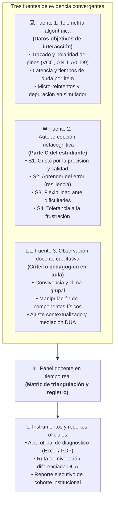
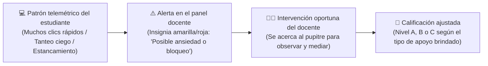
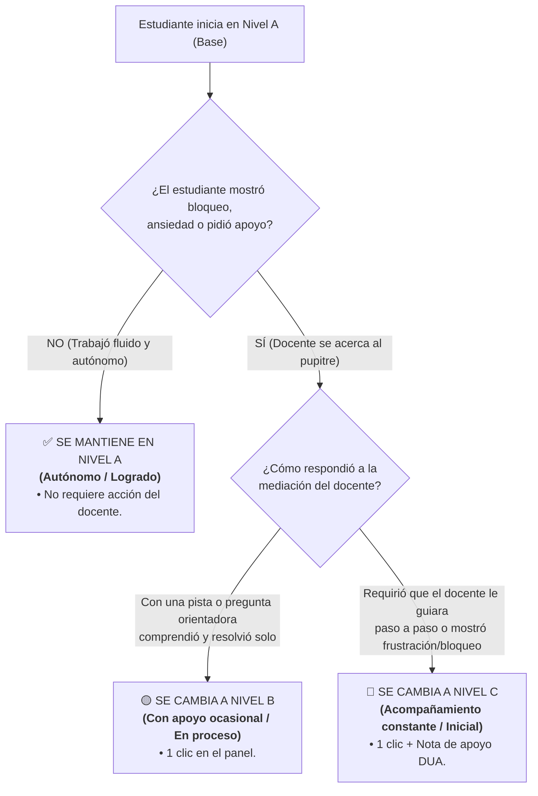

# Arquitectura de evaluación diagnóstica híbrida (triangulación formativa MEP 2027)
**Programa Nacional de Formación Tecnológica (PNFT) • Educación secundaria (7.° a 9.° año)**  
*Ministerio de Educación Pública de Costa Rica • Dirección de Recursos Tecnológicos en Educación (DRTE)*  
*Departamento de Investigación, Desarrollo e Implementación (IDI)*

**Elaborado por:** Allan Morera Araya y Alberto Bustos Ortega  
**Fecha de emisión:** Febrero 2027  
**Versión del documento:** Versión final consolidada 4.0 — Enfoque híbrido triangulado

---

## 1. Resumen ejecutivo y justificación pedagógica

La evaluación de aprendizajes en educación tecnológica contemporánea exige trascender los instrumentos tradicionales de memorización para valorar de forma sistémica tres dimensiones esenciales:
1. **El saber conceptual (área cognoscitiva):** Comprensión de principios de computación física, microcontroladores, lógica condicional y flujo entrada-proceso-salida (E-P-S).
2. **El saber hacer (área psicomotriz y procedimental):** Destreza en el conexionado físico y simulado, polaridad de terminales, correspondencia de puertos y depuración de circuitos.
3. **El saber ser y convivir (área socioafectiva y actitudinal):** Gusto por la calidad, resiliencia ante el error, tolerancia a la frustración, flexibilidad cognitiva y colaboración.

### El desafío del aula real y la respuesta híbrida
En un laboratorio con 30 o 35 estudiantes:
* **El límite de la observación humana exclusiva:** La persona docente no puede registrar simultáneamente cuántas veces cada estudiante reintentó una conexión, cuántos segundos dudó antes de responder, o si corrigió un cortocircuito mediante deducción lógica o por tanteo ciego al azar.
* **El límite de la automatización algorítmica pura:** El software por sí solo no puede captar el clima humano, el lenguaje corporal, la empatía en el trabajo en equipo, la frustración manifiesta o la intencionalidad formativa.

### La solución: Modelo de triangulación formativa de tres fuentes
La **Herramienta de Diagnóstico Estudiantes** resuelve esta tensión articulando tres fuentes convergentes:



---

## 2. El radar pedagógico en tiempo real (sistema de alertas tempranas)

Para evitar que la persona docente deba vigilar 35 pantallas simultáneamente, el **Panel Docente** funciona como un radar de alerta temprana que detecta anomalías telemétricas en vivo y guía al profesor hacia el estudiante que realmente requiere apoyo:



### Indicadores telemétricos de alerta en vivo:
1. **Alerta de tanteo ciego o ansiedad:** Se activa si un estudiante conecta y desconecta cables más de 8 veces en menos de 30 segundos sin manipular el deslizador de luz ni consultar el monitor serial.
2. **Alerta de estancamiento prolongado:** Se activa si el estudiante permanece inactivo por más de 3 minutos en un mismo reactivo o en el banco de componentes.
3. **Alerta de inversión polar crítica:** Se activa si el estudiante conecta terminales de alimentación directa (5V a GND) reiteradamente ignorando los avisos de seguridad.

---

## 3. Desglose exhaustivo por área: Computadora y docente

### 🧠 Dimensión 1: Área cognoscitiva (100% tecnológico)
* **¿Qué hace el sistema?**
  * Administra los 10 criterios oficiales de opción múltiple.
  * Evalúa de forma automática aciertos, fallos y vector cognitivo.
  * Determina el porcentaje global ($0\%$ a $100\%$) y la escala oficial:
    * **Avanzado:** $\ge 80\%$
    * **Intermedio:** $60\% - 79\%$
    * **Inicial:** $\le 59\%$
* **¿Qué hace el docente?**
  * Supervisa el aula y visualiza la consolidación inmediata en el panel.

---

### 🖐️ Dimensión 2: Área psicomotora y procedimental (Modelo híbrido)

| Criterio | ¿Quién lo evalúa? | ¿Qué se evalúa exactamente? |
| :--- | :---: | :--- |
| **P1. Reconocimiento de módulos (E-P-S)** | 🤖 **Telemetría** | Correspondencia lógica entre entrada (LDR), proceso (MCU) y salida (LED). |
| **P2. Polaridad y alimentación (5V / GND)** | 🤖 **Telemetría** | Precisión en líneas de voltaje y tierra sin generar cortocircuitos. |
| **P3. Puertos de señal (A0 / D9)** | 🤖 **Telemetría** | Conexión analógica del sensor y digital PWM del actuador. |
| **P4. Destreza y ergonomía en la mesa** | 👨‍🏫 **Docente (Observable)** | Orden en el puesto de trabajo, motricidad fina y manipulación segura de periféricos. |
| **P5. Coordinación óculo-manual y trazado** | 👨‍🏫 **Docente (Observable)** | Fluidez y firmeza en el conexionado sin temblores ni titubeos por inseguridad. |
| **P6. Verificación metódica del circuito** | 👨‍🏫 **Docente (Observable)** | Comprobación visual previa de los cables antes de energizar o activar el sistema. |

---

### ❤️ Dimensión 3: Área socioafectiva (Modelo híbrido triangulado)

| Criterio | ¿Quién lo evalúa? | ¿Qué se evalúa exactamente? |
| :--- | :---: | :--- |
| **S1. Gusto por la precisión y calidad** | 🤖 **Telemetría y estudiante** | Tiempo de inspección previo al envío ($>15\text{ s}$) y respuesta reflexiva en la Parte C. |
| **S2. Detección de ansiedad y tanteo ciego** | 🤖 **Telemetría (Alerta)** | Frecuencia de clics erráticos por minuto y cambios desordenados de valores. |
| **S3. Tolerancia a la frustración (Resiliencia)** | 👨‍🏫 **Docente (Observable)** | Reacción ante el fallo: compostura, perseverancia o abandono de la tarea. |
| **S4. Flexibilidad y trabajo colaborativo** | 👨‍🏫 **Docente (Observable)** | Escucha activa con el compañero de mesa y receptividad ante sugerencias del docente. |
| **S5. Autonomía y seguridad personal** | 👨‍🏫 **Docente (Observable)** | Iniciativa propia frente a solicitud constante de validación para cada paso menor. |

---

## 4. Protocolo de calificación práctica: «Evaluación por excepción»

Para eliminar la sobrecarga de digitación en el laboratorio, el sistema establece el siguiente flujo operativo:



### Ejemplo práctico de aplicación en el aula:
1. **Detección:** El panel muestra una alerta amarilla en el estudiante **Juan Rosales**: *«12 intentos fallidos de conexión en 45 segundos»*.
2. **Intervención pedagógica y contención socioafectiva:** La persona docente se acerca al pupitre y realiza una mediación formativa:
   * **Pregunta orientadora inicial:** *«Juan, observa el sensor de luz: ¿cuál es el terminal que suministra energía positiva desde el microcontrolador?»*.
3. **Determinación del nivel según la respuesta:**
   * **Caso 1 (Nivel B - Con apoyo ocasional / En proceso):** Juan reflexiona ante la pregunta, revisa la tarjeta, identifica el error (*«¡Es el pin VCC que va al terminal 5V!»*), realiza la conexión de forma autónoma y continúa con seguridad. El docente pulsa **B** en el panel.
   * **Caso 2 (Nivel C - Acompañamiento constante / Inicial):** Juan se bloquea y manifiesta frustración (*«No entiendo nada de esto, no sé qué hacer»*). En este escenario, **la persona docente no resuelve el reto ni le indica las conexiones paso a paso para no falsear la validez del diagnóstico**, sino que realiza un **acompañamiento emocional y socioafectivo**:
     * Le transmite tranquilidad explicándole que esta actividad **no es un examen punitivo con nota numérica**, sino un diagnóstico formativo para conocer sus puntos de partida.
     * Le enfatiza que *«no conocer un tema no está mal; es una valiosa oportunidad para aprender y crecer durante el año lectivo»*.
     * Le invita a avanzar con serenidad y responder con honestidad lo que reconozca.
     * El docente pulsa **C** en el panel y registra una observación formativa para integrar los apoyos necesarios en la ruta de nivelación DUA.
4. **Alumnos sin incidencias:** Los demás 33 estudiantes que resolvieron el reto de manera fluida y autónoma permanecen en **Nivel A** automáticamente, optimizando el tiempo docente.

---

## 5. La Parte C metacognitiva en la aplicación del estudiante

La aplicación del estudiante integra las cuatro preguntas formativas oficiales antes de emitir el comprobante QR:

```
[S1] Gusto por la precisión y calidad:
     (A) Revisé minuciosamente cada conexión, polaridad y respuesta antes de avanzar.
     (B) Revisé solo algunas partes principales del reto.
     (C) Respondí y conecté rápido sin revisar los detalles.

[S2] Aprender del error (resiliencia en depuración):
     (A) Analicé el monitor serial y los fallos con calma, busqué mi error, lo corregí y aprendí algo.
     (B) Intenté corregirlo con apoyo o pistas del simulador.
     (C) Me costó identificar el error o sentí desánimo.

[S3] Flexibilidad y trabajo colaborativo:
     (A) Probé caminos alternos (multímetro u otro orden) y escuché aportes de mi compañero o compañera.
     (B) Acepté modificar la conexión al recibir una sugerencia.
     (C) Seguí insistiendo en la misma conexión aunque no funcionaba.

[S4] Tolerancia a la frustración y perseverancia:
     (A) Mantuve la calma y persistí sistemáticamente hasta que todo funcionó.
     (B) Me costó un poco, pero continué con entusiasmo tras recibir apoyo.
     (C) Sentí frustración o deseos de no continuar.
```

---

## 6. Conclusión y valor estratégico para el MEP

La arquitectura de evaluación híbrida desarrollada para el curso lectivo 2027 consolida los siguientes hitos:
1. **Eficiencia y cero burocracia:** Automatiza el cálculo numérico y la consolidación de actas oficiales en Excel y PDF.
2. **Humanismo pedagógico:** Devuelve a la persona docente su rol como observadora experta y mediadora formativa en lugar de digitadora de datos.
3. **Equidad formativa (DUA):** Permite detectar tempranamente a los estudiantes con rezago o ansiedad tecnológica para brindarles apoyos diferenciados oportunos.

---

**Dirección de Recursos Tecnológicos en Educación (DRTE) • Ministerio de Educación Pública**  
*Elaborado por: Allan Morera Araya y Alberto Bustos Ortega • Febrero 2027.*
